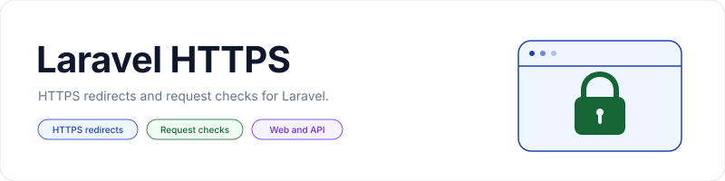

<p align="center">
    <picture>
        <source media="(prefers-color-scheme: dark)" srcset="art/banner-dark.svg">
        <source media="(prefers-color-scheme: light)" srcset="art/banner-light.svg">
        
    </picture>
</p>

<p align="center">Laravel middleware to redirect HTTP requests to HTTPS or deny insecure requests.</p>

<p align="center">
    <a href="https://packagist.org/packages/jeremykenedy/laravel-https"></a>
    <a href="https://packagist.org/packages/jeremykenedy/laravel-https"></a>
    <a href="https://github.com/jeremykenedy/laravel-https/actions/workflows/tests.yml"></a>
    <a href="https://github.styleci.io/repos/110425867?branch=master"></a>
    <a href="LICENSE"></a>
</p>

## Table of Contents

- [Framework Support](#framework-support)
- [Requirements](#requirements)
- [Installation](#installation)
- [Quick Start](#quick-start)
- [Features](#features)
- [Configuration](#configuration)
- [Responses](#responses)
- [Trusted Proxies](#trusted-proxies)
- [Publishing and Customization](#publishing-and-customization)
- [Updating](#updating)
- [Artisan Commands](#artisan-commands)
- [Testing](#testing)
- [License](#license)

## Framework Support

The test suite runs against these combinations:

| Laravel | PHP in CI |
|---------|-----------|
| 5.1, 5.2, 5.3, 5.4, 5.5, 5.6, 5.7, 5.8, 6 | 7.2 |
| 7 | 7.4 |
| 8 | 8.0 |
| 9 | 8.1 |
| 10, 11 | 8.2 |
| 12 | 8.2, 8.3 |
| 13 | 8.3, 8.4, 8.5 |

Historical releases are tested for compatibility with existing applications. This does not extend Laravel's security support for those releases. See the [Laravel support policy](https://laravel.com/docs/releases#support-policy).

This is a middleware package. It works with Blade, Livewire, Vue, React, Svelte, and API clients without frontend dependencies or a build step.

## Requirements

- PHP 7.2 or later, including PHP 8.x.
- A compatible Laravel installation from the matrix above.
- HTTPS configured on your web server or load balancer. This package does not provision certificates.

## Installation

```bash
composer require jeremykenedy/laravel-https
```

Laravel 5.5 and later discover the service provider automatically. On Laravel 5.1 through 5.4, add it to the `providers` array in `config/app.php`:

```php
jeremykenedy\LaravelHttps\LaravelHttpsServiceProvider::class,
```

Publishing is optional. There is no package install command and no automatic file replacement during Composer updates.

## Quick Start

Redirect HTTP requests to HTTPS in production:

```php
use Illuminate\Support\Facades\Route;

Route::get('/account', function () {
    return view('account');
})->middleware('forceHTTPS');
```

Deny insecure requests instead of redirecting:

```php
Route::group(['middleware' => ['checkHTTPS']], function () {
    Route::get('/private', function () {
        return response()->json(['message' => 'Secure request accepted.']);
    });
});
```

Both middleware names can also be passed to `$this->middleware()` in controllers that support constructor middleware. You can use the middleware classes directly when registering global middleware:

```php
jeremykenedy\LaravelHttps\App\Http\Middleware\CheckHTTPS::class
jeremykenedy\LaravelHttps\App\Http\Middleware\ForceHTTPS::class
```

API clients should send `Accept: application/json` when using `checkHTTPS`.

## Features

- `forceHTTPS` redirects insecure requests with their path and query string intact.
- `checkHTTPS` returns the existing error page or a JSON denial.
- Secure requests pass through unchanged.
- Redirects can be limited to a configured environment.
- Error status, views, and translations can be customized.
- No database, JavaScript, or additional runtime package dependencies.

## Configuration

Publish the configuration if you want to edit it:

```bash
php artisan vendor:publish --tag=LaravelHttps
```

Edit `config/laravel-https.php` or set the corresponding environment variables:

| Configuration key | Environment variable | Default | Behavior |
|-------------------|----------------------|---------|----------|
| `ForceHttpsCheckEnvironment` | `LARAVEL_FORCEHTTPSCHECKENVIRONMENT` | `true` | Enables redirects in the configured environment. Setting this to `false` disables redirects. |
| `ForceHttpsEnvironmentToCheck` | `LARAVEL_FORCEHTTPSENVIRONMENTTOCHECK` | `production` | Environment in which `forceHTTPS` redirects. The config value can also be an array of environments. |
| `httpsAccessDeniedErrorCode` | `LARAVEL_HTTP_ERROR_CODE` | `403` | JSON status and code, HTML view name, and fallback denial status. |
| `httpsAccessDeniedHtmlStatus` | `LARAVEL_HTTPS_HTML_STATUS` | `200` | Status for an existing HTML error view. The default preserves previous releases. Set to `403` to return a forbidden status. |

The existing `LaravelHttps` config namespace remains available, including calls such as `config('LaravelHttps.httpsAccessDeniedErrorCode')`. Values explicitly set in that namespace take precedence over the published `laravel-https` config. Rebuild your application's config cache after changing configuration.

## Responses

`forceHTTPS` retains its `302` redirect, including for POST requests. Clients may follow a 302 with a GET, so send API writes directly to HTTPS. It does nothing outside the configured environment or when `ForceHttpsCheckEnvironment` is `false`.

`checkHTTPS` denies insecure requests in every environment. AJAX requests and requests preferring JSON receive:

```json
{
    "code": 403,
    "message": "403 | ForbiddenSSL(HTTPS) is required to view"
}
```

The existing message format and translation keys are preserved. Other requests render `LaravelHttps::errors.403`. If a view for the configured error code is missing, Laravel aborts with that code and message. Errors inside an existing custom view are allowed to surface normally.

To opt into an HTTP 403 status for the HTML error page:

```dotenv
LARAVEL_HTTPS_HTML_STATUS=403
```

## Trusted Proxies

Both middleware use Laravel's request security detection. Configure trusted proxies in your application when TLS terminates at a load balancer, otherwise HTTPS traffic can be seen as HTTP and redirected repeatedly. Untrusted `X-Forwarded-Proto` headers do not bypass the middleware. Follow the [Laravel trusted proxy documentation](https://laravel.com/docs/requests#configuring-trusted-proxies) for your framework version.

## Publishing and Customization

The existing `LaravelHttps` publish tag writes:

| Files | Destination |
|-------|-------------|
| Configuration | `config/laravel-https.php` |
| Error views | `resources/views/vendor/laravel-https` |
| Translations | `resources/lang/vendor/laravel-https` |

The lowercase view and translation directories are now loaded correctly. Existing views in `resources/views/vendor/LaravelHttps` still take precedence. Partial translation overrides retain the package defaults and Laravel's fallback locale behavior. The historical `httpsRequredError` and `httpsRequred` translation keys keep their spelling for compatibility.

Publishing without `--force` keeps existing files. Composer updates never publish or overwrite application files.

## Updating

```bash
composer update jeremykenedy/laravel-https
```

The middleware names, namespace, environment variables, publishing paths, PHP constraint, default redirects, JSON payload, and existing HTML page remain compatible. Published configuration, views, and translations that were previously ignored will now take effect, so review any existing overrides before updating.

See [CHANGELOG.md](CHANGELOG.md) for changes.

## Artisan Commands

This package uses Laravel's existing commands:

| Command | Purpose | Options |
|---------|---------|---------|
| `vendor:publish --tag=LaravelHttps` | Publish optional config, views, and translations. | `--force` replaces existing published files. Use only when you intend to discard customizations. |
| `config:clear` | Clear cached configuration after changes. | None needed. |
| `config:cache` | Rebuild configuration for deployment. | None needed. |

## Testing

For development, use PHP 8.3 or later to install the current framework, PHPUnit, and Pint:

```bash
composer install
composer test
composer lint:test
composer validate --strict
composer audit
```

Run `composer lint` to apply formatting. With Xdebug enabled, run:

```bash
XDEBUG_MODE=coverage vendor/bin/phpunit --coverage-filter src --coverage-text
```

Tests use a real Laravel container, router, view compiler, and translator. They cover secure requests, redirects, query strings, environments, JSON and AJAX denials, custom statuses, missing views, published overrides, and trusted proxies.

The CI matrix selects framework and PHPUnit versions for each PHP runtime. Historical compatibility jobs permit archived dependencies with known advisories in those isolated test jobs only. Current Laravel jobs retain Composer's security blocking, and the quality job audits current dependencies.

## License

This package is open-sourced software licensed under the [MIT license](LICENSE).
